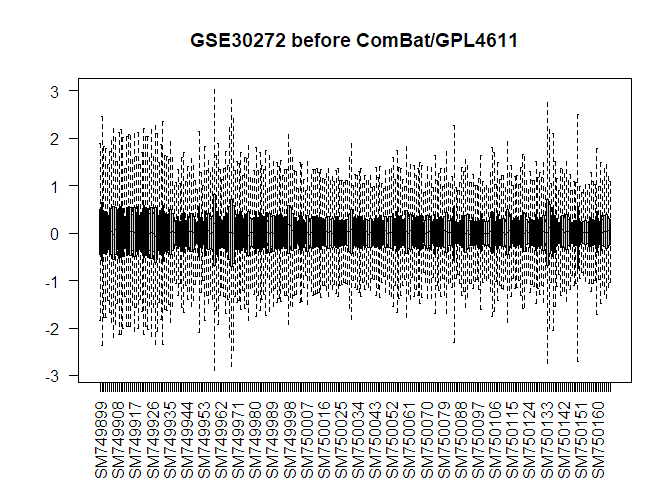
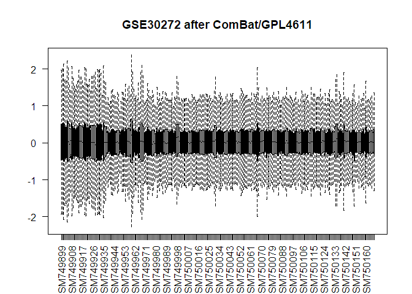
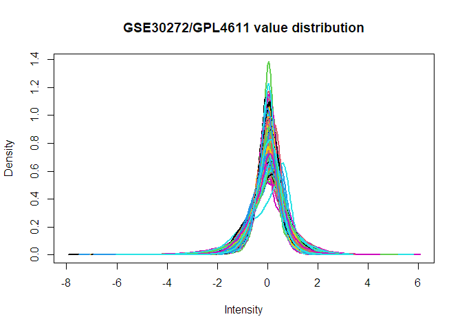

# Knitr settings 


# Load packages 


```r
## Installs packages from Bioconductor 
# BiocManager::install("GEOquery")
# BiocManager::install("edgeR")
# install.packages("cli") 
# install.packages("processx")
# install.packages("rlang")
# devtools::install_github('oganm/markerGeneProfile', force = T)

# Load packages 
library(GEOquery) 
library(limma)
library(umap)
library(tidyverse) 
library(magrittr) 
library(ggpubr) 
library(splitstackshape) 
library(WGCNA) 
library(here)
library(edgeR)
library(markerGeneProfile)
library(matrixStats)
library(cowplot)
library(broom)
library(annotationTools)
library(maptools)
library(RCurl)
library(sva)
```

# Load and process metadata


```r
# Download from GSE
gset = getGEO(GEO = "GSE30272", filename = NULL, destdir = "./", GSElimits = NULL, GSEMatrix = TRUE, AnnotGPL = FALSE, getGPL = FALSE)
# Unlist to get ExpressionSet object
gset = gset[[1]]
pData(gset)$data_processing[1]
```

```
## [1] "Two color intensity data was imported, background subtracted, low intensities dropped, intensities converted to log2(sample/ref), ratios loess normalized, outliers dropped (>6 MADs), missing data from low intesity cut-off were imputed. Only the 30,176 probes (out of the total 49,152 on GPL4611) that passed all quality control and other filters were used. No \"cleaning\" procedure has been applied to these data - see \"Overall design\" and \"Supplemental Files\" for additional data."
```

```r
# Get identifiers from pData
data_meta = data.frame(geo_accession = gset$geo_accession,
                       sample_id = gset$title,
                       age_years = gset$characteristics_ch1.1,
                       sex = gset$characteristics_ch1.2,
                       pmi = gset$characteristics_ch1.4,
                       rin = gset$characteristics_ch1.6,
                       ph = gset$`ph:ch1`,
                       batch =  gset$characteristics_ch1)
# Clean up variables a little 
data_meta = cSplit(indt = data_meta, splitCols = c("age_years","sex","pmi","rin","batch"), 
                  sep = ":", direction = "wide", stripWhite = TRUE)
data_meta = data_meta[,-c(4,6,8,10,12)]
colnames(data_meta) = c("geo_accession","sample_id","ph","age_years","sex","pmi","rin","batch")
data_meta %<>% relocate(ph, .after = rin)

# Get sample ids for prenatal samples
postnatal_samples = data_meta %>% filter(age_years > 15) %>% pull(geo_accession)

# View distribution of ages 
ggplot(data_meta, aes(age_years)) + 
  geom_histogram(bins = 100) +
  theme_bw()
```

<!-- -->

```r
ggplot(data_meta %>% filter(geo_accession %in% postnatal_samples), aes(age_years)) + 
  geom_histogram(bins = 80) +
  theme_bw()
```

<!-- -->

```r
paste("sample age mean: ", mean(unlist(data_meta %>% filter(age_years > 15) %>% pull(age_years))))
```

```
## [1] "sample age mean:  39.4626948121858"
```

```r
paste("sample age sd: ", sd(unlist(data_meta %>% filter(age_years > 15) %>% pull(age_years))))
```

```
## [1] "sample age sd:  16.8421875767115"
```

# Load and process expression data


```r
# get expression
ex = exprs(gset)
# log2 transform
qx = as.numeric(quantile(ex, c(0., 0.25, 0.5, 0.75, 0.99, 1.0), na.rm=T))
LogC = (qx[5] > 100) ||
          (qx[6]-qx[1] > 50 && qx[2] > 0)
if (LogC) { ex[which(ex <= 0)] = NaN
  ex = log2(ex) }

# box-and-whisker plot
title = paste ("GSE30272 before ComBat", "/", annotation(gset), sep ="")
boxplot(ex, boxwex=0.7, notch=T, main=title, outline=FALSE, las=2)
```

<!-- -->

```r
# remove batch-effects 
ex = ComBat(dat = ex,
            batch = data_meta$batch)

# box-and-whisker plot
title = paste ("GSE30272 after ComBat", "/", annotation(gset), sep ="")
boxplot(ex, boxwex=0.7, notch=T, main=title, outline=FALSE, las=2)
```

<!-- -->

```r
# expression value distribution plot
title = paste ("GSE30272", "/", annotation(gset), " value distribution", sep ="")
plotDensities(ex, main=title, legend=F)
```

<!-- -->

```r
# data_exp = read.csv(file = here("input", "GSE30272_ExprsMtxCleanedN269_31SVN.csv"))
# colnames(data_exp)[1] = "probe_id"

# metadata annotating probe ids to genes https://www.ncbi.nlm.nih.gov/geo/query/acc.cgi?acc=GPL4611
annot = read.csv(file = here("input", "GSE30272_annot.csv"))

# format expression dataframe 
data_exp = ex %>% as.data.frame() %>% 
  rownames_to_column(var = "probe_id") %>%
  mutate(probe_id = as.character(probe_id)) %>%
  mutate(gene_name = annot$Gene_Symbol[match(probe_id, annot$ID)]) %>%
  dplyr::select(gene_name, probe_id, everything())

# Remove rows with missing data 
data_exp = data_exp[-which(data_exp == ""),]
data_exp = data_exp[-which(data_exp == "##noname##"),]
# Double-check
data_exp = data_exp[complete.cases(data_exp),]
data_exp %<>% mutate_if(is.factor, ~as.numeric(as.character(.)))

# Collapse multiple microarray probes for a single gene and then merge the data by gene identifier; choosing the probe with the highest 
# average expression leads to best between-study consistency 
# https://www.ncbi.nlm.nih.gov/pmc/articles/PMC3166942/
rownames(data_exp) = data_exp$probe_id
select.rows = collapseRows(datET = data_exp[,-c(1:2)],
                    rowGroup = data_exp$gene_name,
                    rowID = data_exp$probe_id,
                    method = "MaxMean")
rownames(data_exp) = NULL
data_exp %<>% filter(probe_id %in% select.rows$group2row[,2]) %>%
  dplyr::select(-probe_id) 

# Merge gene expression and meta dataframes
data_comb = data_exp %>%   
  column_to_rownames(var = "gene_name") %>%
  t() %>% as.data.frame() %>%
  rownames_to_column(var = "geo_accession")

# save
data_comb = inner_join(data_meta, data_comb, by = 'geo_accession')
write_rds(data_comb, file = here("output", "GSE30272_out.rds"))
```

# Cell type proportion estimation


```r
# Load in marker genes
marker_data = read.csv("https://raw.githubusercontent.com/sonnyc247/MarkerSelection/master/Data/Outputs/CSVs_and_Tables/Markers/All_hodge_regions/new_ALLReg_results_ITexpand_WL35IT_lfct15_minpct25_dup.csv")

# Manually add inhibitory/excitatory suffix to subclass labels 
marker_data %<>%
  mutate(class = case_when(
    subclass == "LAMP5" ~ "Inh",
    subclass == "L5 ET" ~ "Exc",
    subclass == "PAX6" ~ "Inh",
    subclass == "L5/6 IT Car3" ~ "Exc",
    subclass == "VIP" ~ "Inh",
    subclass == "L6 CT" ~ "Exc",
    subclass == "L6 IT"  ~ "Exc",
    subclass == "L6b" ~ "Exc",
    subclass == "PVALB" ~ "Inh",
    subclass == "L5/6 NP" ~ "Exc",
    subclass == "SST" ~ "Inh",
    subclass == "L4 IT" ~ "Exc",
    subclass == "L3/5 IT" ~ "Exc",
    subclass == "L2/3 IT" ~ "Exc")) %>% 
  relocate(class, .before = "subclass") %>%
  unite(subclass, c(class, subclass), sep = "_", remove = F, na.rm = T)
marker_data$subclass = gsub(" ", "_", marker_data$subclass)
marker_data$class[is.na(marker_data$class)] = "NonN"

paste("marker matches in data: ", length(intersect(unlist(data_exp$gene_name), unlist(marker_data$gene))), "/",
      nrow(marker_data))
```

```
## [1] "marker matches in data:  5229 / 12862"
```

```r
# Get vector of unique cell types 
cell_types = marker_data$subclass %>% unique()
# Organize markers into a list 
marker_list = lapply(cell_types, function(cell_type){
  return(marker_data %>% filter(subclass == cell_type) %>% pull(gene) %>% unlist())
  })
names(marker_list) = cell_types

# Run MGP analysis
estimations =  mgpEstimate(
  exprData = data_exp[c("gene_name", postnatal_samples)],
  genes = marker_list,
  geneColName = 'gene_name',
  outlierSampleRemove = FALSE, # should outlier samples removed. This is done using boxplot stats
  geneTransform = NULL, # this is the default option for geneTransform
  groups = NULL, # if there are experimental groups provide them here. if not desired set to NULL
  seekConsensus = FALSE, # ensures gene rotations are positive in both of the groups
  removeMinority = TRUE)

# Merge cell type proportions with sample metadata
mgp_estimates = as.data.frame(estimations$estimates) %>%
  rownames_to_column(var = "geo_accession")
mgp_df = inner_join(data_meta, mgp_estimates, by = "geo_accession") %>%
  pivot_longer(-colnames(data_meta),
               names_to = "cell_type",
               values_to = "cell_proportion")
# fix labels 
mgp_df$cell_type = gsub("\\.", "/", mgp_df$cell_type)

plot_genes = c("Exc_L2/3_IT","Inh_SST","Oligodendrocyte")
plot_list = list()

for(i in 1:length(plot_genes)){
  plot_list[[i]] = ggplot(
    mgp_df %>% filter(cell_type == plot_genes[i]),
    aes(x = age_years, y = cell_proportion)) +
    geom_smooth(method = "lm", se = F) + 
    geom_point() +
    ylab(paste(plot_genes[i], " MGP")) + xlab ("sample age (years)") +
    theme_bw()
}
plot_grid(plotlist = plot_list, nrow =1)
```

<!-- -->

# linear models


```r
# Linear models where cell_type_prop ~ sex + rin + pmi + age_years`
lm_df = mgp_df %>%
  group_by(cell_type) %>%
  do(tidy(lm(scale(cell_proportion) ~ sex + scale(rin) + scale(pmi) + scale(age_years),  data = .))) %>%
  ungroup() %>%
  mutate(padj = p.adjust(`p.value`, method = 'BH')) %>%
  mutate(term = recode(term, 
                       `(Intercept)` = "Intercept", 
                       `sexM` = "sex:M",
                       `sexF` = "sex:F",
                       `scale(rin)` = "rin",
                       `scale(pmi)` = "pmi",
                       `scale(age_years)` = "age_years")) %>%
  mutate(class = case_when(
    str_detect(cell_type, "Inh") ~ "Inhibitory",
    str_detect(cell_type, "Exc") ~ "Excitatory",
    TRUE ~ "Non-Neuronal"
  ))

# Beta coeffs per cell type for phenotype and age effects
beta_plot = lm_df %>% 
  filter(term %in% 'age_years') %>% 
  mutate(cell_type = fct_reorder(cell_type, estimate)) %>% 
  ggplot(aes(x = cell_type, y = estimate)) + 
  geom_hline(yintercept = 0) + 
  geom_bar(stat = "identity") + 
  geom_errorbar(aes(ymin = estimate - std.error, ymax = estimate + std.error)) + 
  ylab('Std. Beta coeff.') + 
  xlab('Cell type proportions') + 
  theme(axis.text.x = element_text(angle = 90, vjust = 0.5, hjust=1)) +
  facet_wrap(~class, drop = T, scale = "free")

beta_plot
```

<!-- -->


