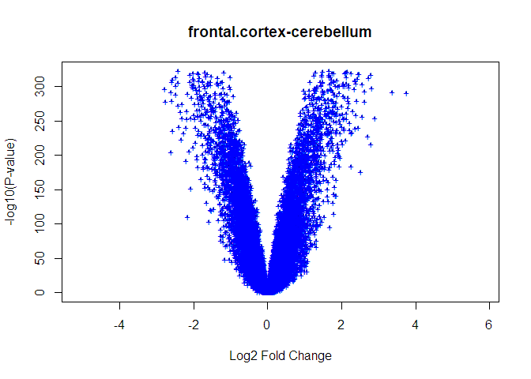
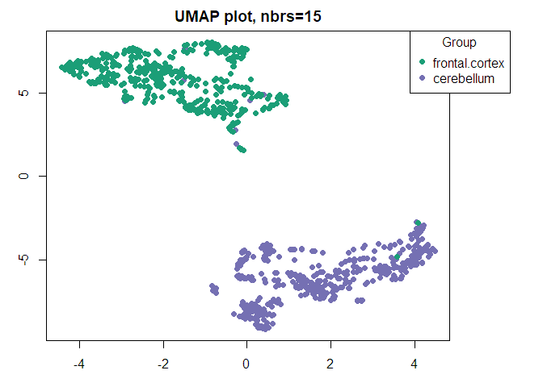

# Knitr settings 


# Load packages 


```r
# # Installs packages from Bioconductor
# BiocManager::install("GEOquery")
# BiocManager::install("edgeR")
# BiocManager::install("annotationTools")
# install.packages("cli")
# install.packages("processx")
# install.packages("rlang")
# devtools::install_github('oganm/markerGeneProfile', force = T)

# Load packages 
library(GEOquery) 
library(limma)
library(umap)
library(tidyverse) 
library(magrittr) 
library(ggpubr) 
library(splitstackshape) 
library(WGCNA) 
library(here)
library(edgeR)
library(markerGeneProfile)
library(matrixStats)
library(cowplot)
library(broom)
library(annotationTools)
library(maptools)
```

# Load data   

Data processing: "Illumina Genome Studio Gene Expression Module v3.2.7, cubic spline normalization"


```r
# load series and platform data from GEO
gset = getGEO("GSE36192", GSEMatrix =TRUE, AnnotGPL=TRUE)
if (length(gset) > 1) idx = grep("GPL6947", attr(gset, "names")) else idx = 1
gset = gset[[idx]]

# make proper column names to match toptable 
fvarLabels(gset) = make.names(fvarLabels(gset))

# group membership for all samples
gsms = paste0("11111111111111111111111111111111111111111111111111",
        "11111111111111111111111111111111111111111111111111",
        "11111111111111111111111111111111111111111111111111",
        "11111111111111111111111111111111111111111111111111",
        "11111111111111111111111111111111111111111111111111",
        "11111111111111111111111111111111111111111111111111",
        "11111111111111111111111111111111111111111111111111",
        "11111111111111111111111111111111111111111111111111",
        "11111111111111111111111111111111111111111111111111",
        "11111100000000000000000000000000000000000000000000",
        "00000000000000000000000000000000000000000000000000",
        "00000000000000000000000000000000000000000000000000",
        "00000000000000000000000000000000000000000000000000",
        "00000000000000000000000000000000000000000000000000",
        "00000000000000000000000000000000000000000000000000",
        "00000000000000000000000000000000000000000000000000",
        "00000000000000000000000000000000000000000000000000",
        "00000000000000000000000000000000000000000000000000",
        "00000000000")
sml = strsplit(gsms, split="")[[1]]

pData(gset)$data_processing[1]
```

```
## [1] "Illumina Genome Studio Gene Expression Module v3.2.7, cubic spline normalization"
```

```r
# log2 transformation
ex = exprs(gset)
qx = as.numeric(quantile(ex, c(0., 0.25, 0.5, 0.75, 0.99, 1.0), na.rm=T))
LogC = (qx[5] > 100) ||
          (qx[6]-qx[1] > 50 && qx[2] > 0)
if (LogC) { ex[which(ex <= 0)] = NaN
  exprs(gset) = log2(ex) }

# assign samples to groups and set up design matrix
gs = factor(sml)
groups = make.names(c("frontal cortex","cerebellum"))
levels(gs) = groups
gset$group = gs
design = model.matrix(~group + 0, gset)
colnames(design) = levels(gs)

fit = lmFit(gset, design)  # fit linear model

# set up contrasts of interest and recalculate model coefficients
cts = paste(groups[1], groups[2], sep="-")
cont.matrix = makeContrasts(contrasts=cts, levels=design)
fit2 = contrasts.fit(fit, cont.matrix)

# compute statistics and table of top significant genes
fit2 = eBayes(fit2, 0.01)
tT = topTable(fit2, adjust="fdr", sort.by="B", number=250)

tT = subset(tT, select=c("ID","adj.P.Val","P.Value","t","B","logFC","Gene.symbol","Gene.title"))
write.table(tT, file=stdout(), row.names=F, sep="\t")
```

```
## "ID"	"adj.P.Val"	"P.Value"	"t"	"B"	"logFC"	"Gene.symbol"	"Gene.title"
## "ILMN_1673450"	0	0	109.631880397466	1199.58936192617	5.57241578728707	"DDN"	"dendrin"
## "ILMN_1807016"	0	0	109.120805491289	1195.64174441723	4.54459147325625	"LHX2"	"LIM homeobox 2"
## "ILMN_1705686"	0	0	106.230820989199	1173.01457135834	5.81692379010412	"NRGN"	"neurogranin"
## "ILMN_1816174"	0	0	104.285389312984	1157.48384336671	3.31000462603164	""	""
## "ILMN_1738749"	0	0	102.261518555973	1141.06312410972	3.73163286239178	"MAST3"	"microtubule associated serine/threonine kinase 3"
## "ILMN_1784036"	0	0	-101.475202611032	1134.60909256607	-4.18849353611319	"CDH15"	"cadherin 15"
## "ILMN_1683405"	0	0	-97.5157190440046	1101.45745578913	-2.85697705668536	"LHX1"	"LIM homeobox 1"
## "ILMN_1712943"	0	0	97.245289302743	1099.15252398262	5.04471367022114	"CCK"	"cholecystokinin"
## "ILMN_1759766"	0	0	95.9619542135855	1088.14149721566	5.03018815979057	"CTXN1"	"cortexin 1"
## "ILMN_1745684"	0	0	-94.8838428412664	1078.79702596789	-2.98999947937999	""	""
## "ILMN_1667381"	0	0	94.6850304871543	1077.06431190746	4.24419000637945	"CAMKV"	"CaM kinase like vesicle associated"
## "ILMN_1681805"	0	0	-94.1506075158117	1072.39181810578	-2.94525819676586	"ZIC3"	"Zic family member 3"
## "ILMN_1660501"	0	0	93.8601578642106	1069.84328877332	4.26273355003376	"LY6H"	"lymphocyte antigen 6 complex, locus H"
## "ILMN_1713764"	0	0	93.4979408908678	1066.65600060539	3.39119794086893	""	""
## "ILMN_1681356"	0	0	93.3152111585225	1065.04426631601	3.06364529934729	"PDE2A"	"phosphodiesterase 2A"
## "ILMN_1752843"	0	0	-91.6780041161179	1050.48790681063	-4.16284277373983	"GRM4"	"glutamate metabotropic receptor 4"
## "ILMN_1825369"	0	0	91.1072687400113	1045.36401204947	3.75593213949438	"NETO1"	"neuropilin and tolloid like 1"
## "ILMN_1760509"	0	0	-89.936997090973	1034.77626852032	-3.85973940874777	"EOMES"	"eomesodermin"
## "ILMN_1729453"	0	0	-89.6759451208073	1032.39939076307	-2.78619787569541	"TSPAN9"	"tetraspanin 9"
## "ILMN_1778844"	0	0	88.9038321343681	1025.33676670704	2.37371655514799	"BRINP2"	"BMP/retinoic acid inducible neural specific 2"
## "ILMN_1810691"	0	0	88.7786344292135	1024.18695757206	3.42683993587603	"ADCY2"	"adenylate cyclase 2"
## "ILMN_1699623"	0	0	88.6548894042505	1023.04921967139	3.0437937458758	"FAM81A"	"family with sequence similarity 81 member A"
## "ILMN_1786118"	0	0	88.3807538952763	1020.52425113557	2.31541198045276	"FXYD7"	"FXYD domain containing ion transport regulator 7"
## "ILMN_1801697"	0	0	-87.8870405377743	1015.9610858498	-2.27016068835862	"SYNE4"	"spectrin repeat containing nuclear envelope family member 4"
## "ILMN_1800697"	0	0	87.7563903874025	1014.75014460201	4.2817066027218	"LDB2"	"LIM domain binding 2"
## "ILMN_1666445"	0	0	87.701298665554	1014.23909441762	4.50719204498617	"CAMK2A"	"calcium/calmodulin dependent protein kinase II alpha"
## "ILMN_1712461"	0	0	-86.5523830027718	1003.52307816971	-4.81410542917502	"CBLN1"	"cerebellin 1 precursor"
## "ILMN_1715189"	0	0	86.1685338920128	999.917911204215	3.19375869230634	"LHX6"	"LIM homeobox 6"
## "ILMN_1713139"	0	0	85.5808934964296	994.374212857813	3.06263405551891	"DLGAP2"	"DLG associated protein 2"
## "ILMN_1804351"	0	0	-85.5605395546531	994.181663710912	-2.96240003669395	"FZD7"	"frizzled class receptor 7"
## "ILMN_1687501"	0	0	85.0768642862249	989.595507293214	2.80130412168592	"MOXD1"	"monooxygenase DBH like 1"
## "ILMN_1737662"	0	0	-84.7329270953275	986.321941041196	-3.54225605499688	"BARHL1"	"BarH like homeobox 1"
## "ILMN_1674519"	0	0	-84.3553289510463	982.716061533726	-5.12265433226056	"ZP2"	"zona pellucida glycoprotein 2"
## "ILMN_1724666"	0	0	-84.0585141636949	979.872813781693	-3.58734157120802	""	""
## "ILMN_1677261"	0	0	83.9777348939481	979.097665660798	2.84052220652205	"LZTS1"	"leucine zipper tumor suppressor 1"
## "ILMN_1805807"	0	0	83.5097741622138	974.595779497333	3.92902978159515	"SLC30A3"	"solute carrier family 30 member 3"
## "ILMN_1813572"	0	0	-82.8916845203343	968.619669389853	-2.4600219543132	"IL16"	"interleukin 16"
## "ILMN_1738657"	0	0	82.8723355592532	968.432037203285	3.45712027287139	"SATB2"	"SATB homeobox 2"
## "ILMN_1716362"	0	0	82.5439769028644	965.242706946033	2.95853921528086	"MPPED1"	"metallophosphoesterase domain containing 1"
## "ILMN_1710410"	0	0	81.59597813332	955.979957478105	2.88335317921864	""	""
## "ILMN_1734380"	0	0	-81.212275242522	952.207487271993	-2.24766416124805	"DPF3"	"double PHD fingers 3"
## "ILMN_1768758"	0	0	80.6536907675889	946.691330301648	3.69834833903223	"CACNG3"	"calcium voltage-gated channel auxiliary subunit gamma 3"
## "ILMN_1671392"	0	0	80.305132992228	943.234550848088	3.24818616879684	"KCNF1"	"potassium voltage-gated channel modifier subfamily F member 1"
## "ILMN_1673104"	0	0	-79.4909562899821	935.115709174045	-2.99722513570234	""	""
## "ILMN_1761903"	0	0	79.3154553577644	933.357452704782	4.40135110062452	"KCNS1"	"potassium voltage-gated channel modifier subfamily S member 1"
## "ILMN_1696339"	0	0	-78.8583438364568	928.764150437662	-3.88013548411342	"ZIC2"	"Zic family member 2"
## "ILMN_1763612"	0	0	78.826594907982	928.444380866462	3.05628330231263	"TMEM132D"	"transmembrane protein 132D"
## "ILMN_1778681"	0	0	-78.7323900355488	927.494999356379	-2.65995257961558	"EBF1"	"early B-cell factor 1"
## "ILMN_1680193"	0	0	-78.4695327384163	924.841474395151	-2.44587513322972	"PAXIP1"	"PAX interacting protein 1"
## "ILMN_1712066"	0	0	-78.43077674496	924.449675045546	-3.16035081389119	"EXPH5"	"exophilin 5"
## "ILMN_1724754"	0	0	-78.3059959662065	923.187237396959	-2.71244943754022	"MPP3"	"membrane palmitoylated protein 3"
## "ILMN_1658685"	0	0	78.2865909489694	922.9907775472	2.53899421405875	"ELFN2"	"extracellular leucine rich repeat and fibronectin type III domain containing 2"
## "ILMN_1663437"	0	0	78.0583670497629	920.677475614391	2.35748936198002	"NECAB2"	"N-terminal EF-hand calcium binding protein 2"
## "ILMN_1669425"	0	0	-78.0491621020443	920.584067861389	-3.2726642041822	"NEUROD1"	"neuronal differentiation 1"
## "ILMN_1683998"	0	0	77.357709228324	913.544036543238	3.89879824927281	"CREG2"	"cellular repressor of E1A stimulated genes 2"
## "ILMN_1740407"	0	0	77.3411147683138	913.374508733086	2.00317622111731	"CHSY3"	"chondroitin sulfate synthase 3"
## "ILMN_1730740"	0	0	-76.8927730490073	908.784091739425	-2.38690071592638	"VSIG8"	"V-set and immunoglobulin domain containing 8"
## "ILMN_1814770"	0	0	76.8202395784736	908.039594740654	3.12674255832024	"CPNE4"	"copine 4"
## "ILMN_1809613"	0	0	76.7886827372157	907.715528052719	3.35782228906849	"NGEF"	"neuronal guanine nucleotide exchange factor"
## "ILMN_1672074"	0	0	-76.7114301575465	906.921784670669	-2.54912964056861	"SHISA8"	"shisa family member 8"
## "ILMN_1677719"	0	0	76.4570563203601	904.304025886118	2.36892392714862	"CHST1"	"carbohydrate sulfotransferase 1"
## "ILMN_1671295"	0	0	75.7798312940619	897.303476935842	2.24343363242923	"CCDC3"	"coiled-coil domain containing 3"
## "ILMN_1677376"	0	0	-75.7658621594853	897.158596338298	-2.55779510209071	"CHD7"	"chromodomain helicase DNA binding protein 7"
## "ILMN_1680251"	0	0	75.5256531037131	894.664223475892	2.38292284424494	"SORCS1"	"sortilin related VPS10 domain containing receptor 1"
## "ILMN_1789112"	0	0	-75.4253360054681	893.620804146069	-2.07254236386645	"TMEM145"	"transmembrane protein 145"
## "ILMN_1733864"	0	0	-75.3861944071085	893.213410533235	-1.85734947983023	""	""
## "ILMN_1752899"	0	0	75.2114961187286	891.393240603063	2.63530466020675	"BCL11A"	"B-cell CLL/lymphoma 11A"
## "ILMN_1788538"	0	0	74.986873785964	889.048403960645	3.65396363802765	"NCALD"	"neurocalcin delta"
## "ILMN_1676449"	0	0	74.8899267251275	888.0348001699	2.79445699740605	"SLIT2"	"slit guidance ligand 2"
## "ILMN_1767894"	0	0	-74.8539887850772	887.658819593225	-2.16178945043022	"POLB"	"DNA polymerase beta"
## "ILMN_1765574"	0	0	-74.8445636761551	887.560193063292	-1.82411738292944	"TFAP2A"	"transcription factor AP-2 alpha"
## "ILMN_1718046"	0	0	74.8136797002548	887.236953033483	1.60448714657044	"ARNT2"	"aryl hydrocarbon receptor nuclear translocator 2"
## "ILMN_1747673"	0	0	74.6811324839495	885.848582177367	2.68631147832232	""	""
## "ILMN_1769615"	0	0	74.5101440135941	884.054927147948	2.41901603496163	"FLRT2"	"fibronectin leucine rich transmembrane protein 2"
## "ILMN_1768202"	0	0	74.397879750519	882.875669866249	2.28539146414796	"ANKRD24"	"ankyrin repeat domain 24"
## "ILMN_1759549"	0	0	-74.3575144055852	882.451347002766	-1.97199417556294	"SRGAP2"	"SLIT-ROBO Rho GTPase activating protein 2"
## "ILMN_1731062"	0	0	74.1775121119038	880.557132433975	3.87437438344684	"NPY"	"neuropeptide Y"
## "ILMN_1718783"	0	0	73.9856405813226	878.534374142715	2.23421774414212	"EXTL1"	"exostosin like glycosyltransferase 1"
## "ILMN_1742544"	0	0	73.9403161683749	878.056003125439	2.96674126252954	"MEF2C"	"myocyte enhancer factor 2C"
## "ILMN_1788886"	0	0	73.6638298413249	875.133302501323	2.12410366960651	"TOX"	"thymocyte selection associated high mobility group box"
## "ILMN_1751689"	0	0	73.56347503534	874.07052343253	2.63416589441108	"CHRM1"	"cholinergic receptor muscarinic 1"
## "ILMN_1724211"	0	0	-73.3989980449643	872.326434646107	-2.02431421673533	"GPRC5C"	"G protein-coupled receptor class C group 5 member C"
## "ILMN_1743933"	0	0	73.3387062128561	871.686410761361	2.09776924425503	"TSHZ3"	"teashirt zinc finger homeobox 3"
## "ILMN_1804339"	0	0	73.0222002307623	868.320400161888	2.60227282286507	"CAMK1G"	"calcium/calmodulin dependent protein kinase IG"
## "ILMN_1665761"	0	0	72.7428095651245	865.340478266009	2.19230940872756	"BCL11B"	"B-cell CLL/lymphoma 11B"
## "ILMN_1767422"	0	0	-72.466078230507	862.38091190885	-1.57632669534463	"POLR1D"	"RNA polymerase I subunit D"
## "ILMN_1805132"	0	0	72.4459962872612	862.165830001695	2.57667027160071	"PCDH19"	"protocadherin 19"
## "ILMN_1754126"	0	0	72.4224588820742	861.913685714085	2.48808334442902	"SH2D5"	"SH2 domain containing 5"
## "ILMN_1705685"	0	0	-72.3892579227907	861.557922210553	-2.26576065043798	"MEIS1"	"Meis homeobox 1"
## "ILMN_1747067"	0	0	71.8241891832789	855.485231854653	1.58883606167215	"NPAS1"	"neuronal PAS domain protein 1"
## "ILMN_1704063"	0	0	71.5580807799579	852.613774854212	2.4020238739172	"KCNH3"	"potassium voltage-gated channel subfamily H member 3"
## "ILMN_1672660"	0	0	71.4440116056128	851.380613650771	2.72035190740059	"MBP"	"myelin basic protein"
## "ILMN_1720710"	0	0	71.333997511296	850.189984887154	2.59775424214758	"HSPB3"	"heat shock protein family B (small) member 3"
## "ILMN_1779147"	0	0	70.8661567039561	845.112410877446	4.43646146897803	"ENC1"	"ectodermal-neural cortex 1"
## "ILMN_1669410"	0	0	70.8405468269753	844.833788396373	3.66955546627017	"CHGA"	"chromogranin A"
## "ILMN_1685580"	0	0	-70.7236345639864	843.560952277475	-2.09478610738346	"CBLB"	"Cbl proto-oncogene B"
## "ILMN_1690139"	0	0	70.4422065410506	840.491017017674	3.53133977787455	""	""
## "ILMN_1657149"	0	0	70.3553230286796	839.541539111056	2.70323616649681	"C8orf46"	"chromosome 8 open reading frame 46"
## "ILMN_1674985"	0	0	-70.3352766039358	839.322353203074	-2.17115644469421	"TMEM51"	"transmembrane protein 51"
## "ILMN_1720595"	0	0	-70.3005266365087	838.942297657685	-2.77088424298314	"MDGA1"	"MAM domain containing glycosylphosphatidylinositol anchor 1"
## "ILMN_1826921"	0	0	-70.257128886077	838.467480149057	-1.90649618063899	"BLACAT1"	"bladder cancer associated transcript 1 (non-protein coding)"
## "ILMN_1800179"	0	0	70.0875497512493	836.610160013149	3.18364132468748	"KCNJ4"	"potassium voltage-gated channel subfamily J member 4"
## "ILMN_1726986"	0	0	70.0042891025564	835.697110770786	1.75572717047796	"AADAT"	"aminoadipate aminotransferase"
## "ILMN_1787576"	0	0	-69.8611244283954	834.125394382034	-3.24541557169018	"CLCNKA"	"chloride voltage-gated channel Ka"
## "ILMN_1669788"	0	0	69.6414170377155	831.709049808484	2.09352868413787	"NUDT14"	"nudix hydrolase 14"
## "ILMN_1663399"	0	0	-69.6064702511696	831.3242223486	-2.8268164615864	"TIMP4"	"TIMP metallopeptidase inhibitor 4"
## "ILMN_1666625"	0	0	69.4800801150449	829.931330999369	1.60022694795137	"KIF17"	"kinesin family member 17"
## "ILMN_1729767"	0	0	-69.3677404742541	828.691826638323	-1.43559429338828	"TARBP2"	"TARBP2, RISC loading complex RNA binding subunit"
## "ILMN_1758067"	0	0	69.3572161097441	828.575635252606	4.72363181826408	"RGS4"	"regulator of G-protein signaling 4"
## "ILMN_1773312"	0	0	-69.338813613481	828.372438516495	-2.08719700415398	"PATJ"	"PATJ, crumbs cell polarity complex component"
## "ILMN_1668490"	0	0	-69.327976931004	828.252764753229	-1.61698035774056	"UNCX"	"UNC homeobox"
## "ILMN_1708341"	0	0	-69.2729259808773	827.644617817976	-2.4467547043231	"PDZK1"	"PDZ domain containing 1"
## "ILMN_1720093"	0	0	-69.2485457412187	827.375184197133	-2.0391719282145	"PCP2"	"Purkinje cell protein 2"
## "ILMN_1697433"	0	0	68.9632683259471	824.217673834507	2.26305175089964	"CYP46A1"	"cytochrome P450 family 46 subfamily A member 1"
## "ILMN_1721167"	0	0	-68.9364435925394	823.920314511991	-2.8468126336355	"MYT1"	"myelin transcription factor 1"
## "ILMN_1657760"	0	0	68.9200887481726	823.738978053172	2.35813145623064	"SYT17"	"synaptotagmin 17"
## "ILMN_1674193"	0	0	68.8381788502008	822.830350706724	1.84764351633606	"EMX1"	"empty spiracles homeobox 1"
## "ILMN_1685318"	0	0	-68.3516089640525	817.417642425582	-1.79242612573545	"EN2"	"engrailed homeobox 2"
## "ILMN_1803652"	0	0	67.6967577178154	810.091694245258	1.6907819926749	"TMEM268"	"transmembrane protein 268"
## "ILMN_1770905"	0	0	67.4860594402583	807.72445235275	1.89340702330748	"SHC3"	"SHC adaptor protein 3"
## "ILMN_1775743"	0	0	-67.408874638141	806.856026215022	-2.23812027942952	"BTG1"	"BTG anti-proliferation factor 1"
## "ILMN_1793517"	0	0	67.3888934494747	806.631104415784	1.74883257797008	"RASAL1"	"RAS protein activator like 1"
## "ILMN_1679460"	0	0	67.2062425965748	804.572996003887	1.71802489568569	"PPFIBP1"	"PPFIA binding protein 1"
## "ILMN_1704369"	0	0	-67.1329202316519	803.745750962129	-2.31246651211996	"LIMA1"	"LIM domain and actin binding 1"
## "ILMN_1710078"	0	0	67.047204234917	802.777914106074	1.32431575890425	"TMEM181"	"transmembrane protein 181"
## "ILMN_1750256"	0	0	-66.918510276202	801.323257823087	-1.95617467017662	"ALS2"	"ALS2, alsin Rho guanine nucleotide exchange factor"
## "ILMN_1672094"	0	0	66.8460130125066	800.502986802406	2.33984392221654	"DLX1"	"distal-less homeobox 1"
## "ILMN_1788184"	0	0	66.8438521173453	800.478528272719	2.32588560167698	"CIDEA"	"cell death-inducing DFFA-like effector a"
## "ILMN_1703487"	0	0	66.8211656105991	800.221714781994	2.42862034635005	"LMO4"	"LIM domain only 4"
## "ILMN_1837428"	0	0	66.6718209553954	798.529674233231	3.11301026259735	"RAB27B"	"RAB27B, member RAS oncogene family"
## "ILMN_1814917"	0	0	-66.5158764741435	796.760179222566	-2.36425615047027	"TLE2"	"transducin like enhancer of split 2"
## "ILMN_1683148"	0	0	66.3959117877847	795.397078925822	2.08059557894567	"PRICKLE2"	"prickle planar cell polarity protein 2"
## "ILMN_1809947"	0	0	66.2829181722265	794.111700923649	3.77136671386867	"TMEM155"	"transmembrane protein 155"
## "ILMN_1671766"	0	0	66.0267729441614	791.192527233952	1.86804915544202	"F12"	"coagulation factor XII"
## "ILMN_1785424"	0	0	-65.9698727435207	790.543051246612	-1.91999091587606	"ABLIM1"	"actin binding LIM protein 1"
## "ILMN_1694530"	0	0	65.8512675069974	789.188073587164	1.46188509063661	"DDA1"	"DET1 and DDB1 associated 1"
## "ILMN_1712283"	0	0	65.6678090126866	787.089044364912	1.44667312600276	"WNT10B"	"Wnt family member 10B"
## "ILMN_1674817"	0	0	65.4033576626175	784.056590793517	2.56542486777061	"C1orf115"	"chromosome 1 open reading frame 115"
## "ILMN_1790978"	0	0	65.17401117057	781.420213155842	1.3821813297724	"ATG7"	"autophagy related 7"
## "ILMN_1693004"	0	0	-65.0308229012021	779.77118423293	-2.4732885559683	"SOGA1"	"suppressor of glucose, autophagy associated 1"
## "ILMN_1729075"	0	0	64.9374955773535	778.695112908831	2.21671071639264	"PTH2R"	"parathyroid hormone 2 receptor"
## "ILMN_1729117"	0	0	64.9146163091934	778.43116047454	2.59022972318066	"COL5A2"	"collagen type V alpha 2 chain"
## "ILMN_1699980"	0	0	-64.8610678580039	777.813150108933	-2.61468392153445	"TSPAN18"	"tetraspanin 18"
## "ILMN_1776121"	0	0	64.8228756908895	777.372167388837	2.81012620747028	"KIAA1211L"	"KIAA1211 like"
## "ILMN_1744403"	0	0	64.7870732019017	776.958624513715	2.248343402041	"KCNIP3"	"potassium voltage-gated channel interacting protein 3"
## "ILMN_1798681"	0	0	-64.7597443089851	776.642858108707	-3.08434862542134	"GABRA6"	"gamma-aminobutyric acid type A receptor alpha6 subunit"
## "ILMN_1747850"	0	0	-64.7258031443124	776.250571786074	-1.64588665887092	""	""
## "ILMN_1796339"	0	0	64.7040910528362	775.999557476874	1.72967088594803	"PLEKHA2"	"pleckstrin homology domain containing A2"
## "ILMN_1753648"	0	0	64.6452950107022	775.319541542642	1.9674391693634	"TRIM51"	"tripartite motif-containing 51"
## "ILMN_1808789"	0	0	-64.6325388036563	775.171954797981	-2.35515312520441	"MYO5C"	"myosin VC"
## "ILMN_1780132"	0	0	-64.5623759805628	774.359849650718	-1.6505142988073	"PELI2"	"pellino E3 ubiquitin protein ligase family member 2"
## "ILMN_1695941"	0	0	64.5311915145198	773.998720288616	3.19345996483464	"NECAB1"	"N-terminal EF-hand calcium binding protein 1"
## "ILMN_1802524"	0	0	64.4858472580363	773.47341427516	1.76001912587641	"ICAM5"	"intercellular adhesion molecule 5"
## "ILMN_1833727"	0	0	-64.2899122839232	771.200807669967	-2.5484875470412	""	""
## "ILMN_1797822"	0	0	-64.2820217942832	771.109194624082	-2.11526480121019	"SEL1L3"	"SEL1L family member 3"
## "ILMN_1787179"	0	0	-64.2475991957655	770.709444499476	-1.61908849693631	"MEGF11"	"multiple EGF like domains 11"
## "ILMN_1748323"	0	0	64.2219217840894	770.411163020695	2.69208680245153	"CXCL14"	"C-X-C motif chemokine ligand 14"
## "ILMN_1751586"	0	0	-64.1808259164041	769.933614243213	-1.99542486042249	""	""
## "ILMN_1653856"	0	0	-63.9943334862856	767.764044915344	-2.56130870144426	"UBASH3B"	"ubiquitin associated and SH3 domain containing B"
## "ILMN_1796069"	0	0	63.9819117682809	767.619392872962	3.12200056701156	"CBLN2"	"cerebellin 2 precursor"
## "ILMN_1814215"	0	0	-63.9292257311773	767.005659966237	-1.53590558782986	"SCNN1G"	"sodium channel epithelial 1 gamma subunit"
## "ILMN_1684694"	0	0	-63.7903413738467	765.386267771863	-1.84720204238347	"ANK1"	"ankyrin 1"
## "ILMN_1670383"	0	0	63.7863079728622	765.339204778411	2.27874339447506	"PCDH7"	"protocadherin 7"
## "ILMN_1712475"	0	0	63.7779890001396	765.242130404887	2.35719341225452	"HS3ST2"	"heparan sulfate-glucosamine 3-sulfotransferase 2"
## "ILMN_1709221"	0	0	63.6944252791114	764.266575637454	1.51477091534965	""	""
## "ILMN_1690125"	0	0	63.6476412439896	763.720045848534	2.15258515294382	"PDLIM7"	"PDZ and LIM domain 7"
## "ILMN_1802646"	0	0	63.5735417101981	762.853895177903	2.8535966161263	"EPHB6"	"EPH receptor B6"
## "ILMN_1717029"	0	0	63.3414084530716	760.136337928143	2.42188991485228	"RTP5"	"receptor transporter protein 5 (putative)"
## "ILMN_1810335"	0	0	63.3399870178937	760.119677958795	2.35053259109813	"DGKB"	"diacylglycerol kinase beta"
## "ILMN_1836531"	0	0	63.2836842894694	759.459590276169	1.4949464516114	"PRRG3"	"proline rich and Gla domain 3"
## "ILMN_1766925"	0	0	63.1062777770103	757.377267330081	2.51963599666518	"CDH13"	"cadherin 13"
## "ILMN_1681304"	0	0	-62.8927742448202	754.866360973896	-1.54083786297137	"PAN3"	"PAN3 poly(A) specific ribonuclease subunit"
## "ILMN_1697629"	0	0	-62.7446445086365	753.121136909784	-2.13123468756412	"JMJD7-PLA2G4B"	"JMJD7-PLA2G4B readthrough"
## "ILMN_1727633"	0	0	62.6601759079631	752.124795448946	2.29484783172183	"NECTIN3"	"nectin cell adhesion molecule 3"
## "ILMN_1747318"	0	0	-62.5673330427782	751.028706887938	-2.09282606124742	"PATJ"	"PATJ, crumbs cell polarity complex component"
## "ILMN_1818256"	0	0	-62.5247705143925	750.525880659102	-2.07046261447104	""	""
## "ILMN_1692903"	0	0	-62.523184653057	750.507141444832	-1.20930923791158	""	""
## "ILMN_1737981"	0	0	-62.4712903098589	749.893772085316	-2.39238569995015	"FSTL5"	"follistatin like 5"
## "ILMN_1665425"	0	0	62.4546228628662	749.696702454373	2.35193663513668	"RPRM"	"reprimo, TP53 dependent G2 arrest mediator candidate"
## "ILMN_1750706"	0	0	62.3151409740254	748.046235474167	1.45546647280522	"FEZF2"	"FEZ family zinc finger 2"
## "ILMN_1669502"	0	0	62.3044264650568	747.919357356982	1.72850822686305	"E2F3"	"E2F transcription factor 3"
## "ILMN_1672878"	0	0	62.2328965969016	747.071973656628	1.79664334541177	"ABR"	"active BCR-related"
## "ILMN_1811468"	0	0	-62.0774686148531	745.228598491637	-2.74023207175076	"IRX3"	"iroquois homeobox 3"
## "ILMN_1651692"	0	0	-61.9512540321086	743.729589116264	-1.43891596861738	"STK10"	"serine/threonine kinase 10"
## "ILMN_1750912"	0	0	61.8612797500935	742.659840699208	1.93513895005004	"STXBP6"	"syntaxin binding protein 6"
## "ILMN_1725862"	0	0	-61.3903423842082	737.044938649342	-1.78392846412344	"USP3"	"ubiquitin specific peptidase 3"
## "ILMN_1838313"	0	0	61.3819183819624	736.944260383562	2.3279474357597	"LRRC8B"	"leucine rich repeat containing 8 family member B"
## "ILMN_1813295"	0	0	61.3093311579693	736.076393813613	2.93812870451024	"LMO3"	"LIM domain only 3"
## "ILMN_1797668"	0	0	-61.1246889079465	733.865941410006	-1.58532616997334	"INSM1"	"INSM transcriptional repressor 1"
## "ILMN_1721128"	6.66000490594e-321	3.95252516672997e-323	60.8476992082869	730.542303188529	1.65645044180798	"TOMM34"	"translocase of outer mitochondrial membrane 34"
## "ILMN_1705562"	6.66000490594e-321	3.95252516672997e-323	-60.8315217828482	730.347904036482	-2.41929768304058	"MTCL1"	"microtubule crosslinking factor 1"
## "ILMN_1759598"	1.49109011914888e-320	8.89318162514244e-323	60.7721876492248	729.634635435988	1.48874829104852	"DLX5"	"distal-less homeobox 5"
## "ILMN_1846002"	1.97749774747959e-319	1.18575755001899e-321	-60.556371330429	727.03669792902	-1.19437567798244	""	""
## "ILMN_1751656"	3.24606069974157e-319	1.95649995753134e-321	-60.5148674126978	726.536443886992	-1.69120460202862	""	""
## "ILMN_1725946"	5.34974281316902e-319	3.24107063671858e-321	-60.4729166887936	726.030593999156	-1.69479051855732	"IRF6"	"interferon regulatory factor 6"
## "ILMN_1682099"	6.49083682880396e-319	3.95252516672997e-321	60.4565235147411	725.832864457152	1.28454807422054	"TNFAIP8L3"	"TNF alpha induced protein 8 like 3"
## "ILMN_1806533"	1.94543288706449e-318	1.1906982064774e-320	60.3652222777538	724.731024970371	2.08956279783172	"PDE7B"	"phosphodiesterase 7B"
## "ILMN_1665492"	4.37559357926383e-318	2.69166963854311e-320	60.2976908637348	723.915398450331	1.73299298896848	"SORCS1"	"sortilin related VPS10 domain containing receptor 1"
## "ILMN_1808501"	4.40155178829633e-318	2.72131357729359e-320	60.2967765997627	723.904352444941	1.78002427316588	"SH3KBP1"	"SH3 domain containing kinase binding protein 1"
## "ILMN_1808956"	9.74504467104546e-318	6.05526855543032e-320	-60.2306284940051	723.104893400111	-2.02703803554741	"TMEM266"	"transmembrane protein 266"
## "ILMN_1705187"	1.16064468730653e-317	7.24794302449109e-320	60.2157682909149	722.925222029277	2.26411785327666	"PLPPR5"	"phospholipid phosphatase related 5"
## "ILMN_1813846"	6.26085816384649e-317	3.92920526824627e-319	-60.0761165113287	721.235423053196	-1.62833642136431	"P2RX4"	"purinergic receptor P2X 4"
## "ILMN_1695606"	1.24531390279189e-316	7.85406275880913e-319	60.0189497108868	720.543021005733	2.45619824984228	"EFNB3"	"ephrin B3"
## "ILMN_1671777"	3.47301049525722e-316	2.20118102797776e-318	59.9339501862152	719.512780615262	2.78563424948034	"FGF13"	"fibroblast growth factor 13"
## "ILMN_1733851"	1.41197363828794e-315	8.99290383509903e-318	59.8179805807249	718.105758067508	1.65914898528691	"DACT3"	"dishevelled binding antagonist of beta catenin 3"
## "ILMN_1675024"	3.38178666894949e-315	2.16437708988775e-317	59.7456800826772	717.227736036521	1.45481805854835	"BEND5"	"BEN domain containing 5"
## "ILMN_1776905"	1.06392965236925e-314	6.84231018859896e-317	59.6510085416027	716.07708213416	1.25593158296866	""	""
## "ILMN_1651832"	1.05293114304623e-313	6.8042898608889e-316	-59.4623403380436	713.780739257767	-1.6783176586813	"EHD1"	"EH domain containing 1"
## "ILMN_1694778"	1.34186639907427e-313	8.71314746344428e-316	-59.4420507556031	713.533531072215	-1.6759601651781	""	""
## "ILMN_1668236"	1.67271196084936e-313	1.09133970788665e-315	59.423579844808	713.308438149725	1.4583032602914	"KCNB2"	"potassium voltage-gated channel subfamily B member 2"
## "ILMN_1655876"	2.75259195748231e-313	1.80444559303139e-315	-59.3823408378742	712.805735929766	-1.52410783738531	"TMEM159"	"transmembrane protein 159"
## "ILMN_1666076"	5.30701516301352e-313	3.49547088749948e-315	59.328139670124	712.144711445856	1.65562093115049	"ARHGEF4"	"Rho guanine nucleotide exchange factor 4"
## "ILMN_1685044"	1.31083994377852e-312	8.67458626230908e-315	-59.253680389631	711.236042231232	-2.49282873595466	"MTUS1"	"microtubule associated tumor suppressor 1"
## "ILMN_1704206"	3.58862521508186e-312	2.38595021601253e-314	-59.1708599336553	710.224545509723	-1.02280620055495	"NPSR1"	"neuropeptide S receptor 1"
## "ILMN_1808707"	4.36814606163807e-312	2.91779725744125e-314	59.1543960870892	710.023371121727	1.69626945535209	"FSCN1"	"fascin actin-bundling protein 1"
## "ILMN_1749848"	7.807830664951e-312	5.23966639832707e-314	59.1065142606926	709.43810806514	2.11896725591418	"SLC35F1"	"solute carrier family 35 member F1"
## "ILMN_1680757"	7.38755562867092e-311	4.98058089111001e-313	-58.9225469227949	707.186866929129	-1.85635181131741	"LRRC26"	"leucine rich repeat containing 26"
## "ILMN_1812073"	7.753393654249e-311	5.25131207203615e-313	-58.9182267159389	707.133950267618	-1.35078148299089	"ATP6V1B1"	"ATPase H+ transporting V1 subunit B1"
## "ILMN_1652017"	7.16528917132504e-310	4.87525500518901e-312	58.7365247554249	704.906288613461	2.43535592572454	"PPEF1"	"protein phosphatase with EF-hand domain 1"
## "ILMN_1737152"	7.48667941914097e-310	5.11718853018614e-312	-58.7325790086058	704.857869195191	-2.02452328949928	"DAO"	"D-amino acid oxidase"
## "ILMN_1783149"	2.92612453618141e-309	2.0091139978752e-311	-58.6212203260615	703.490570711583	-2.57614485010751	"CDH23"	"cadherin-related 23"
## "ILMN_1773063"	1.16026217637827e-308	8.00255392413013e-311	58.5088145343713	702.108880050104	1.71274003898809	"OSBPL1A"	"oxysterol binding protein like 1A"
## "ILMN_1703572"	3.64995440393261e-308	2.52878439145298e-310	58.4153328080003	700.958627934693	2.37079140621415	"PCDH20"	"protocadherin 20"
## "ILMN_1668592"	6.79185461296167e-308	4.7266767120372e-310	-58.3645494183097	700.333312474104	-2.00711494079512	"STON1"	"stonin 1"
## "ILMN_1692394"	9.81635215984641e-307	6.86202266742922e-309	-58.1476229593591	697.658660103984	-1.86565077787404	"KIAA1024"	"KIAA1024"
## "ILMN_1698885"	1.41485533638659e-306	9.93436188595922e-309	58.1176591497797	697.288760401063	2.37149449832602	"PTPRT"	"protein tyrosine phosphatase, receptor type T"
## "ILMN_1815102"	4.50316742672856e-306	3.17587537163259e-308	-58.0236000598583	696.126897164173	-1.76997018933119	"LCAT"	"lecithin-cholesterol acyltransferase"
## "ILMN_1770641"	9.17544426046812e-306	6.49952245125899e-308	-57.9656830727844	695.410939009069	-1.75244320014209	"KLHL3"	"kelch like family member 3"
## "ILMN_1724162"	1.05171529190432e-305	7.48261104937055e-308	57.9542957367536	695.270122650144	1.13645984709892	"ARX"	"aristaless related homeobox"
## "ILMN_1774005"	1.96056291632792e-305	1.40096769116544e-307	-57.903607740735	694.643119372066	-2.58660682512186	"ZIC1"	"Zic family member 1"
## "ILMN_1680390"	2.16598050121829e-305	1.55448316333123e-307	-57.8952064755139	694.539166462087	-1.23389478185287	"GCNT2"	"glucosaminyl (N-acetyl) transferase 2, I-branching enzyme (I blood group)"
## "ILMN_1839444"	2.26614917026063e-305	1.6334128918522e-307	-57.8912049664996	694.489650814011	-2.10418297803221	"LOC100286906"	"uncharacterized LOC100286906"
## "ILMN_1778121"	2.3094683748753e-305	1.67181200902832e-307	-57.8893277009845	694.466420395635	-1.54606777053209	"CALN1"	"calneuron 1"
## "ILMN_1796737"	3.11916331116557e-305	2.26763666950242e-307	57.864703801824	694.161669333513	1.41897452287782	"ZBTB7C"	"zinc finger and BTB domain containing 7C"
## "ILMN_1751326"	4.30820034784497e-305	3.1454533872171e-307	57.8382779554727	693.834534156907	1.4859485703296	"FAM162B"	"family with sequence similarity 162 member B"
## "ILMN_1804007"	1.8248930976375e-304	1.33803949123078e-306	57.7214357771628	692.387074444366	1.49127396199859	"NANOS3"	"nanos C2HC-type zinc finger 3"
## "ILMN_1788377"	2.00159788337451e-304	1.4738207921203e-306	-57.7136405702929	692.290446491239	-2.42748476961703	"COL27A1"	"collagen type XXVII alpha 1 chain"
## "ILMN_1683692"	5.3090205353972e-304	3.92564354374292e-306	-57.6346622632042	691.311024769095	-1.60691551522077	"LRCH1"	"leucine rich repeats and calponin homology domain containing 1"
## "ILMN_1756755"	1.00862606034646e-303	7.48940965056714e-306	57.5826206126321	690.6652294039	2.13393937113402	"LINGO1"	"leucine rich repeat and Ig domain containing 1"
## "ILMN_1669982"	1.41695405229641e-303	1.05654137555888e-305	57.554909511031	690.321220845286	2.05122993913904	"CCDC85A"	"coiled-coil domain containing 85A"
## "ILMN_1693242"	3.10355875592545e-303	2.32378805162965e-305	-57.4914621010806	689.533222202642	-1.37688654006081	"ZNF296"	"zinc finger protein 296"
## "ILMN_1743677"	4.72383016179865e-303	3.55164165394499e-305	-57.4573309177036	689.109117778388	-1.3468134588357	"HNRNPU"	"heterogeneous nuclear ribonucleoprotein U"
## "ILMN_1746658"	7.91163313495019e-303	5.9729917413642e-305	57.4155215009591	688.589410392919	2.37783812608322	"RORB"	"RAR related orphan receptor B"
## "ILMN_1699768"	2.46496815904092e-302	1.86861848201443e-304	57.3238511722149	687.449159049309	2.55224309493212	"CBLN4"	"cerebellin 4 precursor"
## "ILMN_1793934"	5.7903500675513e-302	4.40748055597002e-304	-57.2549359993566	686.591268543638	-1.62013571905589	"PISD"	"phosphatidylserine decarboxylase"
## "ILMN_1717393"	2.45848746640519e-301	1.87898193909241e-303	-57.1385906132657	685.14161467381	-2.04025006949758	"PTCHD1"	"patched domain containing 1"
## "ILMN_1654072"	3.10971074867063e-301	2.38636267723505e-303	57.1194234461489	684.90263321632	2.18930641821761	"CX3CL1"	"C-X3-C motif chemokine ligand 1"
## "ILMN_1731044"	3.74533928004159e-301	2.8857741990565e-303	-57.1041892634687	684.712656957224	-1.54911167745529	"KCTD14"	"potassium channel tetramerization domain containing 14"
## "ILMN_1660732"	4.14926216284626e-301	3.20988684421884e-303	57.0956567459364	684.606240594363	1.43879390187729	"PPP2R2B"	"protein phosphatase 2 regulatory subunit Bbeta"
## "ILMN_1723227"	6.43385731048705e-301	4.99724835375078e-303	-57.0601811189308	684.163697238509	-1.9872395768635	"FGF3"	"fibroblast growth factor 3"
```

```r
# Visualize and quality control test results.
# Build histogram of P-values for all genes. Normal test
# assumption is that most genes are not differentially expressed.
tT2 = topTable(fit2, adjust="fdr", sort.by="B", number=Inf)
hist(tT2$adj.P.Val, col = "grey", border = "white", xlab = "P-adj",
  ylab = "Number of genes", main = "P-adj value distribution")
```

<!-- -->

```r
# summarize test results as "up", "down" or "not expressed"
dT = decideTests(fit2, adjust.method="fdr", p.value=0.05)

# Venn diagram of results
vennDiagram(dT, circle.col=palette())
```

<!-- -->

```r
# create Q-Q plot for t-statistic
t.good = which(!is.na(fit2$F)) # filter out bad probes
qqt(fit2$t[t.good], fit2$df.total[t.good], main="Moderated t statistic")
```

<!-- -->

```r
# volcano plot (log P-value vs log fold change)
colnames(fit2) # list contrast names
```

```
## [1] "frontal.cortex-cerebellum"
```

```r
ct = 1        # choose contrast of interest
volcanoplot(fit2, coef=ct, main=colnames(fit2)[ct], pch=20,
  highlight=length(which(dT[,ct]!=0)), names=rep('+', nrow(fit2)))
```

<!-- -->

```r
# MD plot (log fold change vs mean log expression)
# highlight statistically significant (p-adj < 0.05) probes
plotMD(fit2, column=ct, status=dT[,ct], legend=F, pch=20, cex=1)
abline(h=0)
```

<!-- -->

```r
################################################################
# General expression data analysis
ex = exprs(gset)

# box-and-whisker plot
dev.new(width=3+ncol(gset)/6, height=5)
ord = order(gs)  # order samples by group
ord = ord[c(1:100,(length(ord)-100):(length(ord)))]
palette(c("#1B9E77", "#7570B3", "#E7298A", "#E6AB02", "#D95F02",
          "#66A61E", "#A6761D", "#B32424", "#B324B3", "#666666"))
par(mar=c(7,4,2,1))
title = paste ("GSE36192", "/", annotation(gset), sep ="")
boxplot(ex[,ord], boxwex=0.6, notch=T, main=title, outline=FALSE, las=2, col=gs[ord])
legend("topleft", groups, fill=palette(), bty="n")
dev.off()
```

```
## png 
##   2
```

```r
# expression value distribution
par(mar=c(4,4,2,1))
title = paste ("GSE36192", "/", annotation(gset), " value distribution", sep ="")
plotDensities(ex, group=gs, main=title, legend ="topright")
```

<!-- -->

```r
# UMAP plot (dimensionality reduction)
ex = na.omit(ex) # eliminate rows with NAs
ex = ex[!duplicated(ex), ]  # remove duplicates
ump = umap(t(ex), n_neighbors = 15, random_state = 123)
par(mar=c(3,3,2,6), xpd=TRUE)
plot(ump$layout, main="UMAP plot, nbrs=15", xlab="", ylab="", col=gs, pch=20, cex=1.5)
legend("topright", inset=c(-0.15,0), legend=levels(gs), pch=20, col=1:nlevels(gs), title="Group", pt.cex=1.5)
```

<!-- -->

```r
# mean-variance trend, helps to see if precision weights are needed
plotSA(fit2, main="Mean variance trend, GSE36192")
```

<!-- -->

# Build data frames


```r
# Build sample metadata
data_meta = pData(gset)
data_meta = data.frame(geo_accession = gset$geo_accession,
                       age_years = gset$`age (y):ch1`,
                       sex = gset$`gender:ch1`,
                       region = gset$`tissue:ch1`,
                       pmi = gset$`pmi (hr):ch1`
                       ) 
data_meta %<>% mutate_at(c("age_years","pmi"), ~as.numeric(as.character(.)))

# View distribution of ages 
ggplot(data_meta %>% filter(region == "frontal cortex"), aes(age_years)) + 
  geom_histogram(bins = 50) +
  theme_bw()
```

<!-- -->

```r
paste("frontal cortex individuals:", nrow(data_meta %>% filter(region == "frontal cortex")))
```

```
## [1] "frontal cortex individuals: 455"
```

```r
# Grab probe annotations
if(is(gset,"ExpressionSet")) {
	y = get("exprs",env=gset@assayData)
	if(length(gset@featureData@data)) probe_ann = gset@featureData@data
	if(!is.null(rownames(y))) {
		if(is.null(probe_ann))
			probe_ann = data.frame(ID=I(rownames(y)))
		else
			probe_ann$ID = rownames(y)
		}}
probe_ann %<>% select(ID, Gene.symbol)

# Combined with probe list to get gene symbols
data_exp = ex %>% as.data.frame() %>% rownames_to_column(var = "ID")
data_exp = inner_join(probe_ann, data_exp, by = "ID")
# Remove blank probes 
data_exp = data_exp[-which(data_exp$Gene.symbol == ""),]

# Collapse multiple microarray probes for a single gene and then merge the data by gene identifier; choosing the probe with the highest 
# average expression leads to best between-study consistency 
# https://www.ncbi.nlm.nih.gov/pmc/articles/PMC3166942/
rownames(data_exp) = data_exp$ID
select.rows = collapseRows(datET = data_exp[,-c(1:2)],
                    rowGroup = data_exp$Gene.symbol,
                    rowID = data_exp$ID,
                    method = "maxRowVariance")
rownames(data_exp) = NULL
data_exp %<>% filter(ID %in% select.rows$group2row[,2]) %>%
  dplyr::select(-ID) 

# # Calculate median expression
# medExp = data_exp%>%
#     sepExpr() %>% {.[[2]]} %>%
#     unlist %>% median
# # Remove genes with a median expression below the median expression of the dataset
# data_exp = mostVariable(data_exp, genes = "gene_assignment", threshold = medExp, threshFun = median)
# data_exp = data_exp[complete.cases(data_exp), ]
# rownames(data_exp) = NULL

# Merge gene expression and meta dataframes
data_comb = data_exp %>%   
  column_to_rownames(var = "Gene.symbol") %>%
  t() %>% as.data.frame() %>%
  rownames_to_column(var = "geo_accession")

data_comb = inner_join(data_meta, data_comb, by = 'geo_accession')
```

# Cell type proportion estimation


```r
# Filter data
data_working = data_comb %>% filter(region == "frontal cortex") %>%
  column_to_rownames(var = "geo_accession") %>%
  select(-colnames(data_meta[,-1])) %>%
  t() %>% as.data.frame() %>%
  rownames_to_column(var = "Gene.Symbol")

# Load in marker genes from https://github.com/sonnyc247/MarkerSelection/blob/master/Data/Outputs/CSVs_and_Tables/Markers/MTG_and_CgG_lfct2/new_MTGnCgG_lfct2_results.csv
marker_data = read_csv(file = here("data", "new_MTGnCgG_lfct2_results.csv"))
# Manually add inhibitory/excitatory suffix to subclass labels 
marker_data %<>%
  mutate(class = case_when(
    subclass == "LAMP5" ~ "Inh",
    subclass == "L5 ET" ~ "Exc",
    subclass == "PAX6" ~ "Inh",
    subclass == "L5/6 IT Car3" ~ "Exc",
    subclass == "VIP" ~ "Inh",
    subclass == "L6 CT" ~ "Exc",
    subclass == "IT"  ~ "Exc",
    subclass == "L6b" ~ "Exc",
    subclass == "PVALB" ~ "Inh",
    subclass == "L5/6 NP" ~ "Exc",
    subclass == "SST" ~ "Inh",
    subclass == "L4 IT" ~ "Exc"
  )) %>% 
  relocate(class, .before = "subclass") %>%
  unite(subclass, c(class, subclass), sep = "_", remove = F, na.rm = T)
marker_data$subclass = gsub(" ", "_", marker_data$subclass)
marker_data$class[is.na(marker_data$class)] = "NonN"

paste("marker matches in data: ", length(intersect(unlist(data_working$Gene.Symbol), unlist(marker_data$gene))), "/",
      nrow(marker_data))
```

```
## [1] "marker matches in data:  1425 / 1954"
```

```r
# Get vector of unique cell types 
(cell_types = marker_data$subclass %>% unique())
```

```
##  [1] "Inh_LAMP5"        "Astrocyte"        "VLMC"             "Oligodendrocyte" 
##  [5] "Endothelial"      "Exc_L5_ET"        "Inh_PAX6"         "Exc_L5/6_IT_Car3"
##  [9] "Microglia"        "Pericyte"         "Inh_VIP"          "Exc_L6_CT"       
## [13] "OPC"              "Exc_IT"           "Exc_L6b"          "Inh_PVALB"       
## [17] "Exc_L5/6_NP"      "Inh_SST"          "Exc_L4_IT"
```

```r
# Organize markers into a list 
marker_list = lapply(cell_types, function(cell_type){
  return(marker_data %>% filter(subclass == cell_type) %>% pull(gene) %>% unlist())
  })
names(marker_list) = cell_types

# Run MGP analysis
estimations =  mgpEstimate(
  exprData = data_working,
  genes = marker_list,
  geneColName = 'Gene.Symbol',
  outlierSampleRemove = FALSE, # should outlier samples removed. This is done using boxplot stats
  geneTransform = NULL, # this is the default option for geneTransform
  groups = NULL, # if there are experimental groups provide them here. if not desired set to NULL
  seekConsensus = FALSE, # ensures gene rotations are positive in both of the groups
  removeMinority = TRUE)
# Lost cell types 
setdiff(cell_types, names(estimations$estimates))
```

```
## character(0)
```

```r
# Merge cell type proportions with sample metadata
mgp_estimates = as.data.frame(estimations$estimates) %>%
  rownames_to_column(var = "geo_accession")
mgp_df = inner_join(data_meta, mgp_estimates, by = "geo_accession") %>%
  pivot_longer(-colnames(data_meta),
               names_to = "cell_type",
               values_to = "cell_proportion")

plot_genes = c("Exc_IT","Inh_SST","Oligodendrocyte")
plot_list = list()

for(i in 1:length(plot_genes)){
  plot_list[[i]] = ggplot(
    mgp_df %>% filter(cell_type == plot_genes[i]),
    aes(x = age_years, y = cell_proportion)) +
    geom_smooth(method = "lm", se = F) + 
    geom_point() +
    ylab(paste(plot_genes[i], " MGP")) + xlab ("sample age (years)") +
    theme_bw()
}
plot_grid(plotlist = plot_list, nrow = 1)
```

<!-- -->

# Linear models


```r
# Linear models where cell_type_prop ~ sex + pmi + age_years`
lm_df = mgp_df %>%
  group_by(cell_type) %>%
  do(tidy(lm(scale(cell_proportion) ~ sex + scale(pmi) + scale(age_years),  data = .))) %>%
  ungroup() %>%
  mutate(padj = p.adjust(`p.value`, method = 'BH')) %>%
  mutate(term = recode(term, 
                       `(Intercept)` = "Intercept", 
                       `sexM` = "sex:M",
                       `sexF` = "sex:F",
                       `scale(rin)` = "rin",
                       `scale(pmi)` = "pmi",
                       `scale(age_years)` = "age_years")) %>%
  mutate(class = case_when(
    str_detect(cell_type, "Inh") ~ "Inhibitory",
    str_detect(cell_type, "Exc") ~ "Excitatory",
    TRUE ~ "Non-Neuronal"
  ))

# Beta coeffs per cell type for phenotype and age effects
beta_plot = lm_df %>% 
  filter(term %in% 'age_years') %>% 
  mutate(cell_type = fct_reorder(cell_type, estimate)) %>% 
  ggplot(aes(x = cell_type, y = estimate)) + 
  geom_hline(yintercept = 0) + 
  geom_bar(stat = "identity") + 
  geom_errorbar(aes(ymin = estimate - std.error, ymax = estimate + std.error)) + 
  ylab('Std. Beta coeff.') + 
  xlab('Cell type proportions') + 
  theme(axis.text.x = element_text(angle = 90, vjust = 0.5, hjust=1)) +
  facet_wrap(~class, drop = T, scale = "free")

beta_plot
```

<!-- -->


