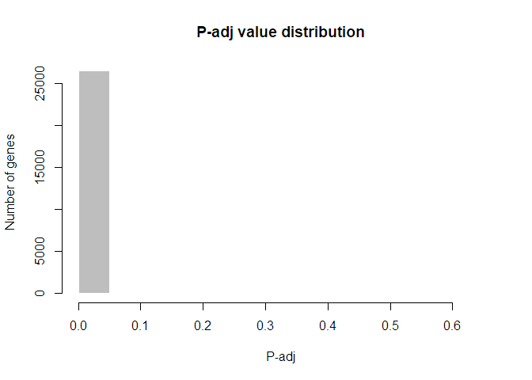
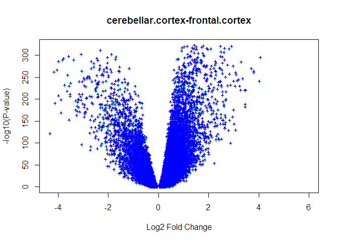
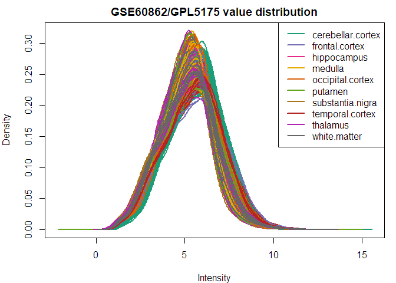
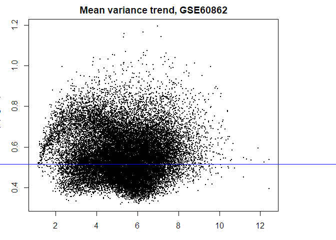
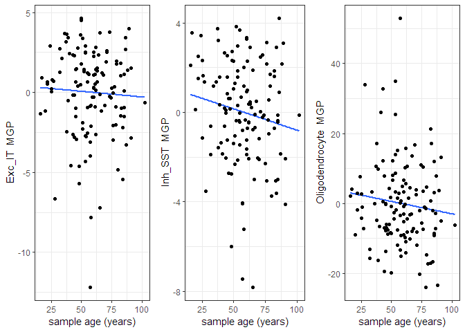
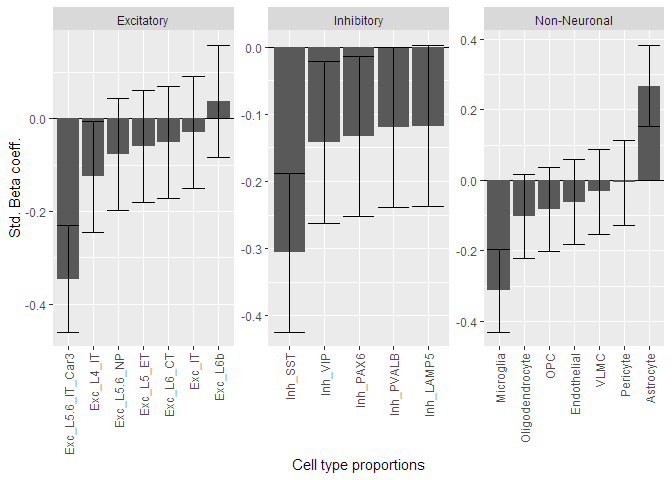

# Knitr settings 


# Load packages 


```r
# # Installs packages from Bioconductor
# BiocManager::install("GEOquery")
# BiocManager::install("edgeR")
# BiocManager::install("annotationTools")
# install.packages("cli")
# install.packages("processx")
# install.packages("rlang")
# devtools::install_github('oganm/markerGeneProfile', force = T)

# Load packages 
library(GEOquery) 
library(limma)
library(umap)
library(tidyverse) 
library(magrittr) 
library(ggpubr) 
library(splitstackshape) 
library(WGCNA) 
library(here)
library(edgeR)
library(markerGeneProfile)
library(matrixStats)
library(cowplot)
library(broom)
library(annotationTools)
library(maptools)
```

# Load data

Preprocessing steps read: "Data were processed using Affymetrix Power Tools 1.14.3. Arrays were pre-processed using RMA quantile normalization with background correction. Gene level summary signals were generated by calculating the Winsorized mean (10% and 90%) of all probe sets annotated to a transcript."

Probe group file: HuEx-1_0-st-v2.r2.pgf
"Transcript assignments are based on genome build hg19"
"Core exons only are included in this analysis" 


```r
# load series and platform data from GEO
gset = getGEO("GSE60862", GSEMatrix =TRUE, AnnotGPL=FALSE)
if (length(gset) > 1) idx = grep("GPL5175", attr(gset, "names")) else idx = 1
gset = gset[[idx]]

# # make proper column names to match toptable 
fvarLabels(gset) = make.names(fvarLabels(gset))

# group membership for all samples
gsms = paste0("00001111223344445556667777888999900000000000111111",
        "11111222222222233333344444444444555555555566666666",
        "67777777777788888888899999999999000000000111111111",
        "12222222222333333333444444444555555555666666677777",
        "77788888888899999999990000000000000000000000000000",
        "00000000000000000000000000000011111111111111111111",
        "11111111111111111111111111111111111111222222222222",
        "22222222222222222222222222222222222222222222233333",
        "33333333333333333333333333333333333333333333333333",
        "34444444444444444444444444444444444444444444444444",
        "44444444455555555555555555555555555555555555555555",
        "55555555555555555566666666666666666666666666666666",
        "66666666666677777777777777777777777777777777777777",
        "77777777777777788888888888888888888888888888888888",
        "88888888888888888888889999999999999999999999999999",
        "99999999999999999999999999999000000001111222223333",
        "33444444555555556666667777777788888888999999990000",
        "00000001111111111122222222222333333333334444444444",
        "45555555555566666666777777777788888888889999999999",
        "90000001111122222333333444444555555666677778888889",
        "99999000000111111222222333333444444555555666677777",
        "78888889999990000111122223333444455556666777788899",
        "99000011112222333344445555666777788889999000111233",
        "34445566677788899900000011111112222222333333444444",
        "4555555566666677778888889999999")
sml = strsplit(gsms, split="")[[1]]

# log2 transformation
ex = exprs(gset)
qx = as.numeric(quantile(ex, c(0., 0.25, 0.5, 0.75, 0.99, 1.0), na.rm=T))
LogC = (qx[5] > 100) ||
          (qx[6]-qx[1] > 50 && qx[2] > 0)
if (LogC) { ex[which(ex <= 0)] = NaN
  exprs(gset) = log2(ex) }

# assign samples to groups and set up design matrix
gs = factor(sml)
groups = make.names(c("cerebellar cortex","frontal cortex","hippocampus","medulla","occipital cortex","putamen","substantia nigra","temporal cortex","thalamus","white matter"))
levels(gs) = groups
gset$group = gs
design = model.matrix(~group + 0, gset)
colnames(design) = levels(gs)

fit = lmFit(gset, design)  # fit linear model

# set up contrasts of interest and recalculate model coefficients
cts = paste(groups, c(tail(groups, -1), head(groups, 1)), sep="-")
cont.matrix = makeContrasts(contrasts=cts, levels=design)
fit2 = contrasts.fit(fit, cont.matrix)

# compute statistics and table of top significant genes
fit2 = eBayes(fit2, 0.01)
tT = topTable(fit2, adjust="fdr", sort.by="B", number=250)

tT = subset(tT, select=c("ID","adj.P.Val","P.Value","F","GB_LIST","SPOT_ID","RANGE_GB","RANGE_STRAND","RANGE_START"))
#write.table(tT, file=stdout(), row.names=F, sep="\t")

# Visualize and quality control test results.
# Build histogram of P-values for all genes. Normal test
# assumption is that most genes are not differentially expressed.
tT2 = topTable(fit2, adjust="fdr", sort.by="B", number=Inf)
hist(tT2$adj.P.Val, col = "grey", border = "white", xlab = "P-adj",
  ylab = "Number of genes", main = "P-adj value distribution", bins =1000)
```

<!-- -->

```r
# summarize test results as "up", "down" or "not expressed"
dT = decideTests(fit2, adjust.method="fdr", p.value=0.05)

# create Q-Q plot for t-statistic
t.good = which(!is.na(fit2$F)) # filter out bad probes
qqt(fit2$t[t.good], fit2$df.total[t.good], main="Moderated t statistic")
```

<!-- -->

```r
# volcano plot (log P-value vs log fold change)
colnames(fit2) # list contrast names
```

```
##  [1] "cerebellar.cortex-frontal.cortex" "frontal.cortex-hippocampus"      
##  [3] "hippocampus-medulla"              "medulla-occipital.cortex"        
##  [5] "occipital.cortex-putamen"         "putamen-substantia.nigra"        
##  [7] "substantia.nigra-temporal.cortex" "temporal.cortex-thalamus"        
##  [9] "thalamus-white.matter"            "white.matter-cerebellar.cortex"
```

```r
ct = 1        # choose contrast of interest
volcanoplot(fit2, coef=ct, main=colnames(fit2)[ct], pch=20,
  highlight=length(which(dT[,ct]!=0)), names=rep('+', nrow(fit2)))
```

<!-- -->

```r
# MD plot (log fold change vs mean log expression)
# highlight statistically significant (p-adj < 0.05) probes
plotMD(fit2, column=ct, status=dT[,ct], legend=F, pch=20, cex=1)
abline(h=0)
```

<!-- -->

```r
################################################################
# General expression data analysis
ex = exprs(gset)

# box-and-whisker plot
dev.new(width=3+ncol(gset)/6, height=5)
ord = order(gs)  # order samples by group
palette(c("#1B9E77", "#7570B3", "#E7298A", "#E6AB02", "#D95F02",
          "#66A61E", "#A6761D", "#B32424", "#B324B3", "#666666"))
par(mar=c(7,4,2,1))
title = paste ("GSE60862", "/", annotation(gset), sep ="")
boxplot(ex[,ord], boxwex=0.6, notch=T, main=title, outline=FALSE, las=2, col=gs[ord])
legend("topleft", groups, fill=palette(), bty="n")
dev.off()
```

```
## png 
##   2
```

```r
# expression value distribution
par(mar=c(4,4,2,1))
title = paste ("GSE60862", "/", annotation(gset), " value distribution", sep ="")
plotDensities(ex, group=gs, main=title, legend ="topright")
```

<!-- -->

```r
# UMAP plot (dimensionality reduction)
ex = na.omit(ex) # eliminate rows with NAs
ex = ex[!duplicated(ex), ]  # remove duplicates
ump = umap(t(ex), n_neighbors = 15, random_state = 123)
par(mar=c(3,3,2,6), xpd=TRUE)
plot(ump$layout, main="UMAP plot, nbrs=15", xlab="", ylab="", col=gs, pch=20, cex=1.5)
legend("topright", inset=c(-0.15,0), legend=levels(gs), pch=20,
col=1:nlevels(gs), title="Group", pt.cex=1.5)
```

<!-- -->

```r
#pointLabel(ump$layout, labels = rownames(ump$layout), method="SANN", cex=0.6)

# mean-variance trend, helps to see if precision weights are needed
plotSA(fit2, main="Mean variance trend, GSE60862")
```

<!-- -->

# Build data frames


```r
# Build sample metadata
data_meta = pData(gset)
data_meta = data.frame(geo_accession = gset$geo_accession,
                       age_years = gset$`age at death (in years):ch1`,
                       sex = gset$`Sex:ch1`,
                       region = gset$`brain region:ch1`,
                       ancestry = gset$`ancestry:ch1`,
                       pmi = gset$`post-mortem interval (in hours):ch1`,
                       rin = gset$`rin:ch1`,
                       ph = gset$`brain ph:ch1`
                       ) 
data_meta %<>% mutate_at(c("age_years","pmi","rin","ph"), ~as.numeric(as.character(.)))

# View distribution of ages 
ggplot(data_meta %>% filter(region == "frontal cortex"), aes(age_years)) + 
  geom_histogram(bins = 50) +
  theme_bw()
```

<!-- -->

```r
paste("frontal cortex individuals:", nrow(data_meta %>% filter(region == "frontal cortex")))
```

```
## [1] "frontal cortex individuals: 127"
```

```r
# Grab probe annotations
if(is(gset,"ExpressionSet")) {
	y = get("exprs",env=gset@assayData)
	if(length(gset@featureData@data)) probe_ann = gset@featureData@data
	if(!is.null(rownames(y))) {
		if(is.null(probe_ann))
			probe_ann = data.frame(ID=I(rownames(y)))
		else
			probe_ann$ID = rownames(y)
		}}
probe_ann %<>% select(ID, gene_assignment) %>%
  separate(gene_assignment, c(NA,"gene_assignment"), " // ")

# Combined with probe list to get gene symbols
data_exp = ex %>% as.data.frame() %>% rownames_to_column(var = "ID")
data_exp = inner_join(probe_ann, data_exp, by = "ID")

# Collapse multiple microarray probes for a single gene and then merge the data by gene identifier; choosing the probe with the highest 
# average expression leads to best between-study consistency 
# https://www.ncbi.nlm.nih.gov/pmc/articles/PMC3166942/
rownames(data_exp) = data_exp$ID
select.rows = collapseRows(datET = data_exp[,-c(1:2)],
                    rowGroup = data_exp$gene_assignment,
                    rowID = data_exp$ID,
                    method = "maxRowVariance")
rownames(data_exp) = NULL
data_exp %<>% filter(ID %in% select.rows$group2row[,2]) %>%
  dplyr::select(-ID) 

# # Calculate median expression
# medExp = data_exp%>%
#     sepExpr() %>% {.[[2]]} %>%
#     unlist %>% median
# # Remove genes with a median expression below the median expression of the dataset
# data_exp = mostVariable(data_exp, genes = "gene_assignment", threshold = medExp, threshFun = median)
# data_exp = data_exp[complete.cases(data_exp), ]
# rownames(data_exp) = NULL

# Merge gene expression and meta dataframes
data_comb = data_exp %>%   
  column_to_rownames(var = "gene_assignment") %>%
  t() %>% as.data.frame() %>%
  rownames_to_column(var = "geo_accession")

data_comb = inner_join(data_meta, data_comb, by = 'geo_accession')
```

# Cell type proportion estimation


```r
# Filter data
data_working = data_comb %>% filter(region == "frontal cortex") %>%
  column_to_rownames(var = "geo_accession") %>%
  select(-colnames(data_meta[,-1])) %>%
  t() %>% as.data.frame() %>%
  rownames_to_column(var = "Gene.Symbol")

# Load in marker genes from https://github.com/sonnyc247/MarkerSelection/blob/master/Data/Outputs/CSVs_and_Tables/Markers/MTG_and_CgG_lfct2/new_MTGnCgG_lfct2_results.csv
marker_data = read_csv(file = here("data", "new_MTGnCgG_lfct2_results.csv"))
# Manually add inhibitory/excitatory suffix to subclass labels 
marker_data %<>%
  mutate(class = case_when(
    subclass == "LAMP5" ~ "Inh",
    subclass == "L5 ET" ~ "Exc",
    subclass == "PAX6" ~ "Inh",
    subclass == "L5/6 IT Car3" ~ "Exc",
    subclass == "VIP" ~ "Inh",
    subclass == "L6 CT" ~ "Exc",
    subclass == "IT"  ~ "Exc",
    subclass == "L6b" ~ "Exc",
    subclass == "PVALB" ~ "Inh",
    subclass == "L5/6 NP" ~ "Exc",
    subclass == "SST" ~ "Inh",
    subclass == "L4 IT" ~ "Exc"
  )) %>% 
  relocate(class, .before = "subclass") %>%
  unite(subclass, c(class, subclass), sep = "_", remove = F, na.rm = T)
marker_data$subclass = gsub(" ", "_", marker_data$subclass)
marker_data$class[is.na(marker_data$class)] = "NonN"

paste("marker matches in data: ", length(intersect(unlist(data_working$Gene.Symbol), unlist(marker_data$gene))), "/",
      nrow(marker_data))
```

```
## [1] "marker matches in data:  1510 / 1954"
```

```r
# Get vector of unique cell types 
(cell_types = marker_data$subclass %>% unique())
```

```
##  [1] "Inh_LAMP5"        "Astrocyte"        "VLMC"             "Oligodendrocyte" 
##  [5] "Endothelial"      "Exc_L5_ET"        "Inh_PAX6"         "Exc_L5/6_IT_Car3"
##  [9] "Microglia"        "Pericyte"         "Inh_VIP"          "Exc_L6_CT"       
## [13] "OPC"              "Exc_IT"           "Exc_L6b"          "Inh_PVALB"       
## [17] "Exc_L5/6_NP"      "Inh_SST"          "Exc_L4_IT"
```

```r
# Organize markers into a list 
marker_list = lapply(cell_types, function(cell_type){
  return(marker_data %>% filter(subclass == cell_type) %>% pull(gene) %>% unlist())
  })
names(marker_list) = cell_types

# Run MGP analysis
estimations =  mgpEstimate(
  exprData = data_working,
  genes = marker_list,
  geneColName = 'Gene.Symbol',
  outlierSampleRemove = FALSE, # should outlier samples removed. This is done using boxplot stats
  geneTransform = NULL, # this is the default option for geneTransform
  groups = NULL, # if there are experimental groups provide them here. if not desired set to NULL
  seekConsensus = FALSE, # ensures gene rotations are positive in both of the groups
  removeMinority = TRUE)
# Lost cell types 
setdiff(cell_types, names(estimations$estimates))
```

```
## character(0)
```

```r
# Merge cell type proportions with sample metadata
mgp_estimates = as.data.frame(estimations$estimates) %>%
  rownames_to_column(var = "geo_accession")
mgp_df = inner_join(data_meta, mgp_estimates, by = "geo_accession") %>%
  pivot_longer(-colnames(data_meta),
               names_to = "cell_type",
               values_to = "cell_proportion")

plot_genes = c("Exc_IT","Inh_SST","Oligodendrocyte")
plot_list = list()

for(i in 1:length(plot_genes)){
  plot_list[[i]] = ggplot(
    mgp_df %>% filter(cell_type == plot_genes[i]),
    aes(x = age_years, y = cell_proportion)) +
    geom_smooth(method = "lm", se = F) + 
    geom_point() +
    ylab(paste(plot_genes[i], " MGP")) + xlab ("sample age (years)") +
    theme_bw()
}
plot_grid(plotlist = plot_list, nrow = 1)
```

<!-- -->

# Linear models


```r
# Linear models where cell_type_prop ~ sex + rin + pmi + age_years`
lm_df = mgp_df %>%
  group_by(cell_type) %>%
  do(tidy(lm(scale(cell_proportion) ~ sex + scale(rin) + scale(pmi) + scale(age_years),  data = .))) %>%
  ungroup() %>%
  mutate(padj = p.adjust(`p.value`, method = 'BH')) %>%
  mutate(term = recode(term, 
                       `(Intercept)` = "Intercept", 
                       `sexM` = "sex:M",
                       `sexF` = "sex:F",
                       `scale(rin)` = "rin",
                       `scale(pmi)` = "pmi",
                       `scale(age_years)` = "age_years")) %>%
  mutate(class = case_when(
    str_detect(cell_type, "Inh") ~ "Inhibitory",
    str_detect(cell_type, "Exc") ~ "Excitatory",
    TRUE ~ "Non-Neuronal"
  ))

# Beta coeffs per cell type for phenotype and age effects
beta_plot = lm_df %>% 
  filter(term %in% 'age_years') %>% 
  mutate(cell_type = fct_reorder(cell_type, estimate)) %>% 
  ggplot(aes(x = cell_type, y = estimate)) + 
  geom_hline(yintercept = 0) + 
  geom_bar(stat = "identity") + 
  geom_errorbar(aes(ymin = estimate - std.error, ymax = estimate + std.error)) + 
  ylab('Std. Beta coeff.') + 
  xlab('Cell type proportions') + 
  theme(axis.text.x = element_text(angle = 90, vjust = 0.5, hjust=1)) +
  facet_wrap(~class, drop = T, scale = "free")

beta_plot
```

<!-- -->


